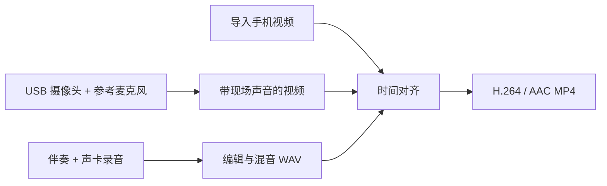

# Cover Recorder

面向乐器翻弹的 Windows 桌面录制工具：导入伴奏、录制声卡输入、整理音轨，再将高质量混音与演奏视频合成 MP4。

**MVP 主流程已完成并通过实机验收。** 支持导入手机视频，也支持直接使用 USB 摄像头和现场麦克风录制。当前发布源码，需要本机构建和 Python 环境；尚未提供独立安装包。

## 能做什么

- **录音与编辑**：伴奏轨、多条录音轨、逐轨输入分配、输入电平与监听、停止保留或丢弃 take；支持分割、裁剪、替换式重录、轨道音量、片段增益、静音/独奏和撤销重做。
- **工程与混音**：保存、重开 Tracktion 工程，导出混音 WAV；检查缺失素材，保留已有导出，自动使用新文件名。
- **视频合成**：使用混音替换视频原声，支持自动估计时间偏移和手动修正，统一导出 H.264/AAC MP4。
- **摄像头采集**：摄像头和参考麦克风录制带现场声音的视频，声卡独立录制高质量音频；主窗口 Stop 后保存两路素材、对齐并合成。自动对齐可靠性不足时转为手动偏移。

## 工作流程



摄像头麦克风负责记录可供对齐的现场声；成品只使用混音音轨，原始录音与视频保留。原生窗口中的手机视频导入入口使用手动偏移；独立 Python 工具和摄像头流程支持自动估计。

## 快速使用

### 声卡录音 + 摄像头

1. 打开 `Cover Recorder.exe`，在 `Audio Setup` 中选择声卡输入输出。
2. `Import Backing` 导入伴奏；选择录音轨和 `Input`，勾选 `Record this track`。多条 Ready 轨会一起录制。
3. `More > Camera + reference sound...`，分别选择摄像头和现场麦克风，点击“预览并准备录制”。
4. 画面就绪后，在主窗口点击 `Record`，等待显示 Recording 后开始演奏。摄像头模式从工程 0 秒开始。
5. 点击 `Stop`。程序保存录音与带声音的视频，渲染混音并尝试自动对齐；需要时会弹出手动偏移窗口。
6. 在工程目录打开 `cover.mp4` 检查成品。

本机实测组合：Windows Audio + Focusrite Input 1，以及系统名称为 `icspring camera` 的 USB 摄像头及其自带麦克风。

### 导入已有视频

录音和混音完成后，在原生窗口选择 `More > Export video...`，选取视频并填写偏移。正值让混音延后，负值裁去混音开头。

也可单独运行 Python 对轨工具，选择视频和外部音频，自动分析或直接填写手动偏移后导出：

```powershell
conda run --no-capture-output -n cover-syncer python -m cover_syncer
```

### 成品保存在哪里

默认工程目录：`%USERPROFILE%\Documents\CoverRecorderSessions\<时间戳>`。也可在 `More` 中打开当前工程文件夹。

| 文件 | 内容 |
| --- | --- |
| `session.tracktionedit` | 轨道、片段、音量及素材引用 |
| `*.wav` | 原始录音与混音导出 |
| `camera-*/recording/capture.mkv` | 带参考声音的摄像头原始视频 |
| `cover.mp4` | 合成成品；重复导出会使用新文件名 |

`Ctrl+S` 保存工程，`Ctrl+O` 重开。导入素材按路径引用，移动工程时还需保留或迁移外部素材；当前没有工程打包功能。

## 从源码运行

### 环境

已验证 Windows 11 x64、Visual Studio 2026 C++ 工具链、CMake、Miniconda、Python 3.10。核心依赖为 Tracktion Engine 3.2.0 / JUCE 8.0.12，以及 PySide6、NumPy、SciPy、SoundFile、FFmpeg / ffprobe。

从项目根目录执行以下步骤。CMake 命令可在 Visual Studio 的 Developer PowerShell 中运行；若不在 PATH，请使用 Visual Studio 安装目录内的 `cmake.exe`。

### 1. Python 环境

```powershell
git clone https://github.com/rz3228-ruiyao/cover-recorder.git
cd cover-recorder
conda env create -f environment.yml
```

环境配置会以 editable 模式安装当前项目。已有环境可用 `conda env update -n cover-syncer -f environment.yml` 更新。

### 2. 获取固定版本的录音引擎

第三方引擎不随本仓库提交。使用本机已验证的提交及其 JUCE 子模块：

```powershell
git clone --filter=blob:none --no-checkout https://github.com/Tracktion/tracktion_engine.git .spikes/tracktion_engine
git -C .spikes/tracktion_engine checkout 2877b621f2fbee564d0696a616b86bf8ba8c8ab0
git -C .spikes/tracktion_engine -c url.https://github.com/.insteadOf=git@github.com: submodule update --init --recursive
```

JUCE 子模块对应提交为 `7c89e11f6b7316c369f3d3f22227c60e816e738b`。已有引擎目录也可以通过 CMake 的 `-DTRACKTION_ENGINE_DIR=...` 指定。

### 3. 构建并启动原生应用

```powershell
cmake -S native/cover_recorder -B native/cover_recorder/build/windows-vs2026 -G 'Visual Studio 18 2026' -A x64
cmake --build native/cover_recorder/build/windows-vs2026 --config Release --target CoverRecorderNative --parallel 4
& './native/cover_recorder/build/windows-vs2026/CoverRecorderNative_artefacts/Release/Cover Recorder.exe'
```

原生应用默认调用 `%USERPROFILE%\miniconda3\envs\cover-syncer\python.exe`。如果 Conda 安装在其他目录，启动前指定实际路径：

```powershell
$env:COVER_RECORDER_PYTHON = 'D:\Miniconda\envs\cover-syncer\python.exe'
```

辅助程序会在导入依赖前加载该 Python 环境的 DLL 和 FFmpeg 路径，正常启动不需要先激活 Conda。不要把 exe 单独拷走当成完整安装包。

## 格式与范围

支持导入 MP4、MOV、M4V、MKV、AVI、WMV、WebM、MPG/MPEG、MTS/M2TS/TS、FLV、3GP。兼容的 8-bit H.264 直接复制画面，其他可解码的 SDR 视频转为 H.264；实际支持还取决于容器内部编码。

- 当前只支持 SDR；HDR PQ/HLG 会明确拒绝，尚未实现色调映射。
- 摄像头输出按比例缩放到 1280×720 范围，帧率取决于设备；尚未提供采集规格选择。
- 当前构建未启用 ASIO，实录验收使用 Windows Audio。
- 对齐校正起点偏移，尚未处理长时间设备时钟漂移。
- iPhone 可继续通过录像文件导入；未实现手机应用或原生无线摄像头协议，也未实测第三方桥接软件。
- 多机位、插件宿主产品化、安装包和跨平台适配不在本轮 MVP 范围。

## 验证

本轮采用模块检查加关键实机联动验收，原始私人素材不随仓库发布：

| 验证项 | 已有结果 |
| --- | --- |
| Focusrite 实录与回放 | 用户确认播放正常 |
| 已有视频 + 高质量音频 | 手动对齐成品获用户确认 |
| 摄像头 + 参考麦克风 + Focusrite | 主窗口录制、Stop 保存、合成成品获用户确认 |
| 自动化基线 | 摄像头版本完整回归 68 项通过，无跳过 |
| 随后的直接启动修复 | 采集与原生导出专项 17 项通过，包含新增的无 Conda 激活启动检查 |
| 工程与素材保护 | 工程恢复、重渲染、缺失素材、偏移方向、原文件保护及格式集成检查 |

复现测试：

```powershell
$env:COVER_RECORDER_TEST_EXE = (Resolve-Path 'native/cover_recorder/build/windows-vs2026/CoverRecorderNative_artefacts/Release/Cover Recorder.exe').Path
$env:QT_QPA_PLATFORM = 'offscreen'
conda run --no-capture-output -n cover-syncer python -m pytest -q -ra
conda run --no-capture-output -n cover-syncer python tests/verify_native_session.py --exe $env:COVER_RECORDER_TEST_EXE
```

不设置 `COVER_RECORDER_TEST_EXE` 时，原生进程集成用例会跳过。设备拔插、其他型号兼容性和长时间漂移仍未实测。

## 代码与文档

| 路径 | 用途 |
| --- | --- |
| `native/cover_recorder/Source/` | C++ 原生录音、工程管理与后台任务协调 |
| `src/cover_syncer/` | Python 对齐、媒体处理、摄像头采集与 Qt 界面 |
| `tests/` | 生成素材、Qt 状态、媒体处理和原生进程集成检查 |
| [MVP 验收总结](docs/mvp_status.md) | 已完成范围及后续边界 |
| [原生录音器](docs/native_cover_recorder.md) | 编辑操作、快捷键和工程说明 |
| [摄像头采集](docs/camera_capture.md) | 双路采集、文件状态和验收记录 |
| [视频导出](docs/native_video_export.md) | 容器/编码策略和偏移规则 |
| [第三方依赖](THIRD_PARTY.md) | 引擎来源与上游许可文件 |

`docs/` 中其他阶段记录保留了当时的测试与限制；当前项目状态以本 README 和 MVP 验收总结为准。
